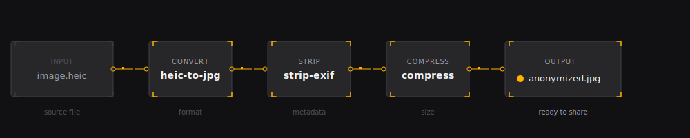
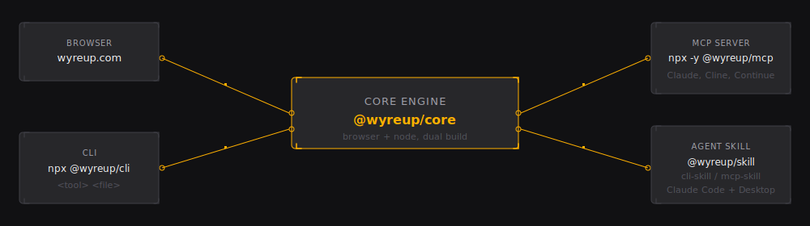
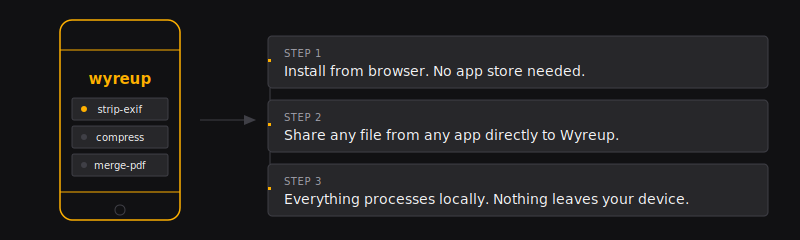

# Wyreup

**Wyreup your capabilities. Nothing uploads.**

[wyreup.com](https://wyreup.com) · MIT License · v0.1.0


---

Wyreup is an open-source toolbelt for your files, your terminal, and your agent. Drop a file in the browser, run a command in your shell, or let your AI assistant invoke the same engine. Everything executes on your device — no server, no upload, no tracking.

The same tool engine ships across five surfaces. Whether you reach it from a browser, a CLI, or an MCP-compatible agent, the privacy guarantee is identical: nothing touches a server.

---

## What's possible

### Share a photo safely

Drop a HEIC or JPEG. Strip GPS coordinates and camera metadata, then compress it down to a size worth sending.

```
strip-exif → compress
```

Run it now: [wyreup.com/chain/run?steps=strip-exif|compress](https://wyreup.com/chain/run?steps=strip-exif%7Ccompress)

---

### Merge receipts into one searchable PDF

Drop receipt images. Convert each to a PDF page, then merge into one multi-page document.

```
image-to-pdf → merge-pdf
```

CLI:

```bash
wyreup image-to-pdf receipt1.jpg receipt2.jpg -o receipts.pdf
wyreup merge-pdf receipts.pdf -o final.pdf
```

Run it now: [wyreup.com/chain/run?steps=image-to-pdf|merge-pdf](https://wyreup.com/chain/run?steps=image-to-pdf%7Cmerge-pdf)

---

### Redact and lock a contract

Drop a PDF. Blur the signature block, add a password, add page numbers to the output.

```
pdf-redact → pdf-encrypt → page-numbers-pdf
```

Run it now: [wyreup.com/chain/run?steps=pdf-redact|pdf-encrypt|page-numbers-pdf](https://wyreup.com/chain/run?steps=pdf-redact%7Cpdf-encrypt%7Cpage-numbers-pdf)

---

### Enhance a low-quality voice memo

Drop an audio file. Wyreup upscales it to 48 kHz via a local ONNX model.

```
audio-enhance
```

CLI:

```bash
wyreup audio-enhance voicememo.m4a -o clean.wav
```

Run it now: [wyreup.com/tools/audio-enhance](https://wyreup.com/tools/audio-enhance)

---

## Chain anything

Every Wyreup tool takes a file and produces a file. Chain them to solve real problems in one pipeline.



Build a chain at [wyreup.com/chain/build](https://wyreup.com/chain/build). Save it to your Kit. Share the URL with anyone — they drop a file, it runs the exact pipeline on their device. No accounts. No data leaves.

---

## The toolbelt

- **Images** — compress, convert, resize, crop, rotate, flip, watermark, face blur, strip EXIF, image diff, OCR, SVG rendering, favicon generation, color palette
- **PDFs** — merge, split, compress, crop, rotate, reorder, extract and delete pages, page numbers, encrypt and decrypt, redact, extract tables and text, convert to and from images, watermark, metadata
- **Audio** — enhance and upscale low-quality recordings
- **Text and data** — JSON, YAML, CSV, base64, URL encoding, Markdown and HTML, regex, hashing, JWT decode, SQL, XML, HTML and CSS formatting, diff, word count
- **Create** — QR codes, UUIDs, secure passwords, lorem ipsum, slugs
- **Finance** — compound interest, dollar-cost averaging, percentages, dates

Full catalog: [wyreup.com/tools](https://wyreup.com/tools)

---

## Everywhere your files are

Wyreup ships as five packages built on one engine.



| Surface | How |
|---|---|
| Browser | [wyreup.com/tools](https://wyreup.com/tools) — no install |
| PWA | Install from browser for offline access and native file sharing |
| CLI | `npx @wyreup/cli <tool> <file>` |
| MCP server | `npx -y @wyreup/mcp` — connects Claude Code, Cline, Continue, and any MCP-compatible agent |
| Agent skill | `@wyreup/skill`, `@wyreup/cli-skill`, `@wyreup/mcp-skill` — richer integration for skill-compatible runtimes |

---

## Install as an app



Open [wyreup.com](https://wyreup.com) and install as a PWA. On mobile, share any file from any app straight to Wyreup and see which tools can handle it. Configure which tools cache offline at [wyreup.com/settings](https://wyreup.com/settings).

---

## Architecture

| Package | Description |
|---|---|
| `packages/core` | Tool library (`@wyreup/core`) — framework-free, dual browser/Node build |
| `packages/web` | Astro 4 static site — wyreup.com, fully static, PWA |
| `packages/cli` | `wyreup` CLI (`@wyreup/cli`) |
| `packages/mcp` | MCP server (`@wyreup/mcp`) |
| `packages/skill` | Agent skill (`@wyreup/skill`) — CLI + MCP guidance for skill-compatible runtimes |
| `packages/cli-skill` | CLI-only agent skill (`@wyreup/cli-skill`) — smaller token footprint |
| `packages/mcp-skill` | MCP-only agent skill (`@wyreup/mcp-skill`) — smaller token footprint |

See [docs/ARCHITECTURE.md](./docs/ARCHITECTURE.md) for the full design.

---

## Development

Prerequisites: Node >= 20, pnpm 9.

```bash
pnpm install
pnpm build       # builds all packages in dependency order
pnpm test        # runs all test suites
```

Run the web app locally:

```bash
pnpm --filter @wyreup/web dev
```

Run just the core library tests:

```bash
pnpm --filter @wyreup/core test
```

Scaffold a new tool:

```bash
wyreup init-tool
```

---

## Self-hosting

The site is a fully static Astro build that deploys to any static host. See [DEPLOYMENT.md](./DEPLOYMENT.md) for Cloudflare Pages setup, CI/CD workflow details, GitHub secrets, and npm publishing instructions.

---

## Contributing

See [CONTRIBUTING.md](./CONTRIBUTING.md). To scaffold a new tool module with the correct folder structure, types, defaults, test file, and registry entry, run `wyreup init-tool`.

---

## Contact · Security · License

General inquiries: hello@wyreup.com

Security issues: security@wyreup.com — please do not open a public issue for vulnerabilities.

MIT — see [LICENSE](./LICENSE).
